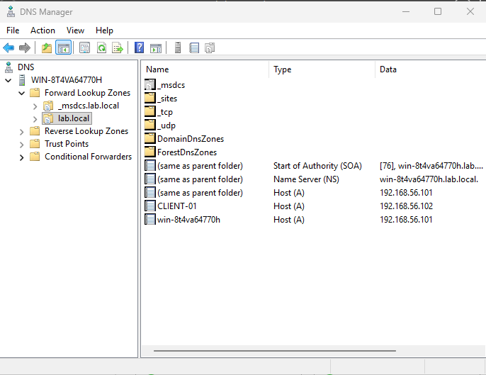
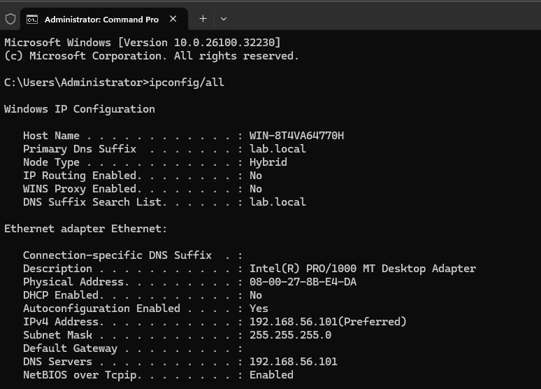
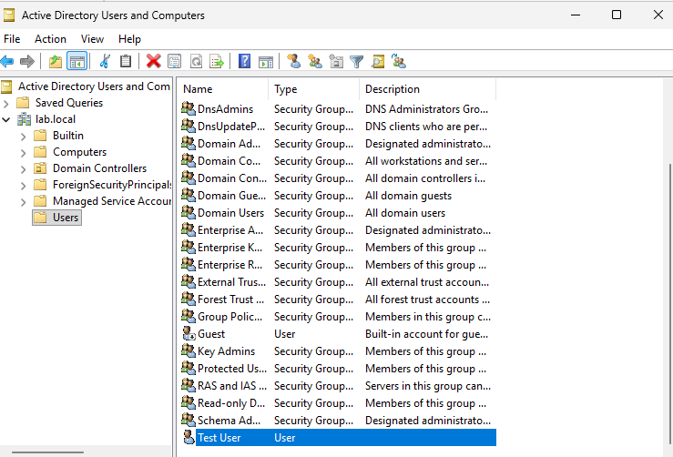
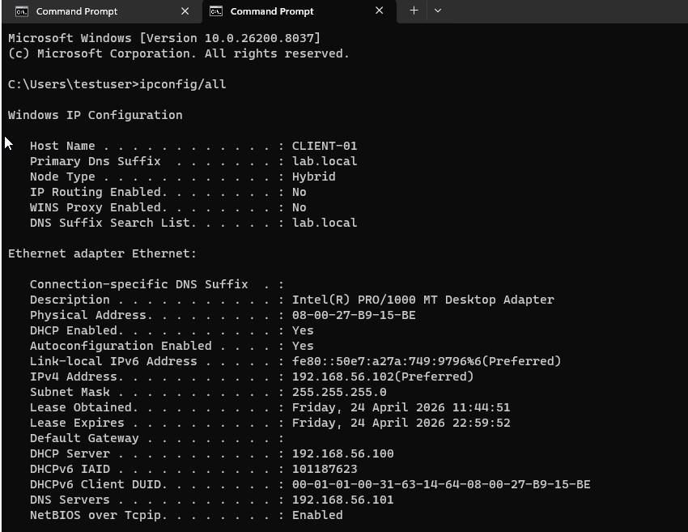
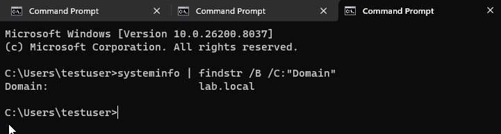
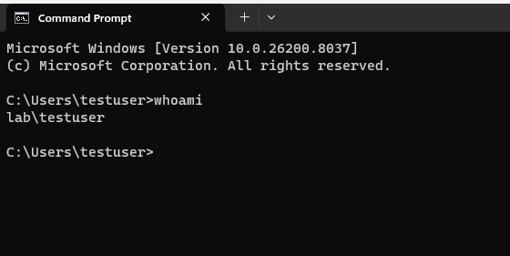
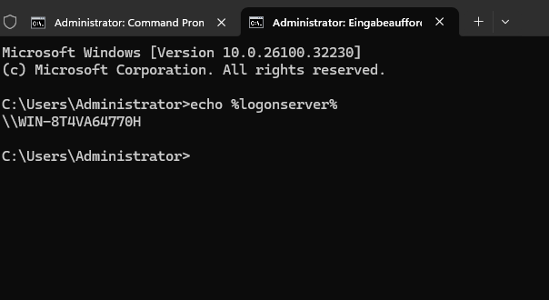
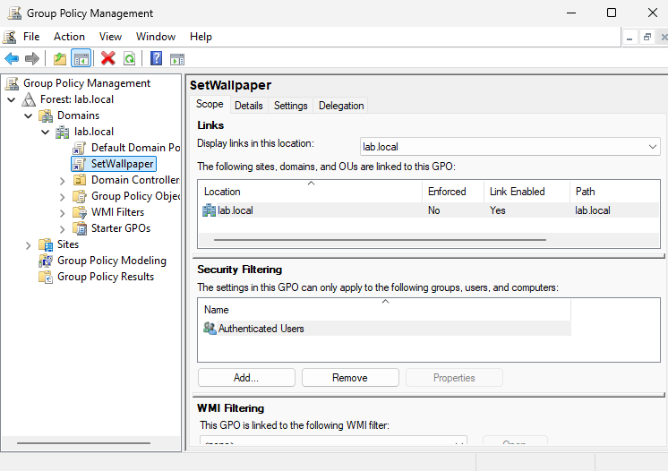
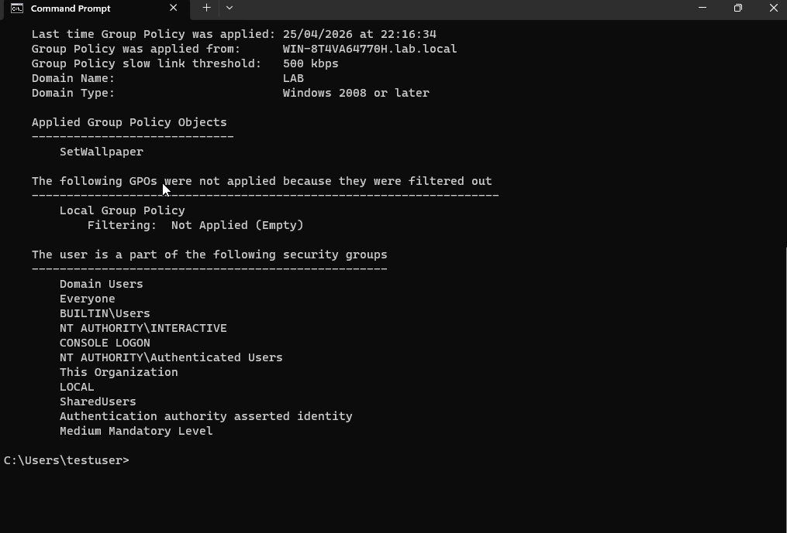

# Active Directory Home Lab

## Zusammenfassung (Deutsch)

In diesem Projekt wurde eine Active-Directory-Umgebung mit Windows Server und einem Windows-Client aufgebaut. Der Server wurde als Domain Controller konfiguriert und stellt gleichzeitig den DNS-Dienst bereit. Ein Client-System wurde erfolgreich in die Domäne `lab.local` integriert, und die Anmeldung mit einem Domänenbenutzer wurde getestet. Ziel war es, grundlegende Konzepte wie DNS, Domain Join und Benutzerverwaltung in einer realistischen IT-Umgebung zu verstehen.

---

## Overview

This project documents the setup of a basic Active Directory home lab using Windows Server, a Windows client, DNS, and VirtualBox. The environment simulates a real enterprise network where a client machine joins a domain and authenticates using centralized user management through Active Directory.

---

## Lab Architecture

```text
Windows Client (CLIENT-01)
        |
        | Domain Join / Authentication
        |
Windows Server (Domain Controller + DNS)
Domain: lab.local
IP: 192.168.56.101
```
---
## Technologies Used

- Windows Server 2025 Evaluation
- Windows 11 Pro Client
- Active Directory Domain Services (AD DS)
- DNS Server
- VirtualBox
- Host-only networking
---
## What I Built

- Installed Windows Server in VirtualBox
- Promoted the server to a Domain Controller
- Created the domain `lab.local`
- Configured DNS for Active Directory
- Set a static IP address for the Domain Controller
- Installed a Windows client machine
- Joined the client to the domain
- Logged into the client using an Active Directory domain user
---
## Network Configuration

### Domain Controller

```text
Hostname: WIN-8T4VA64770H
Domain: lab.local
IP Address: 192.168.56.101
Subnet Mask: 255.255.255.0
DNS Server: 192.168.56.101
```

### Windows Client

```text
Hostname: CLIENT-01
IP Address: 192.168.56.102
DNS Server: 192.168.56.101
```
---
## Verification Commands

### Check current logged-in user

```cmd
whoami
```

Expected result:

```text
lab\testuser
```

### Check logon server

```cmd
echo %logonserver%
```

Expected result:

```text
\\WIN-8T4VA64770H
```

### Check domain information

```cmd
systeminfo | findstr /B /C:"Domain"
```

Expected result:

```text
Domain: lab.local
```

### Test DNS resolution

```cmd
nslookup lab.local
```

Expected result:

```text
Name: lab.local
Address: 192.168.56.101
```

### Test network connectivity

```cmd
ping 192.168.56.101
```
---
## Troubleshooting

### 1. Domain could not be found
**Problem:** The Windows client could not find `lab.local` during domain join.

**Cause:** The client was not using the Domain Controller as its DNS server.

**Solution:** Set the client DNS server to the Domain Controller IP address:

```text
192.168.56.101
```

### 2. DHCP vs Static IP on Domain Controller
**Problem:** The Domain Controller initially received its IP address automatically through DHCP.

**Cause:** DHCP can assign different IP addresses, which is not suitable for a DNS server or Domain Controller.

**Solution:** Configured a static IP address:

```text
192.168.56.101
```

### 3. DNS resolution issues
**Problem:** `nslookup lab.local` showed confusing output such as `Server: Unknown`.

**Cause:** Reverse lookup was not configured, but forward DNS resolution still worked.

**Solution:** Verified that `lab.local` resolved correctly to the Domain Controller IP address.

### 4. DNS service verification
**Problem:** Needed to confirm whether the DNS service was running and listening.

**Commands used:**

```cmd
sc query dns
netstat -an | find ":53"
```
---
## What I Learned

- How Active Directory depends heavily on DNS
- Why a Domain Controller should use a static IP address
- How domain users differ from local users
- How Windows clients locate a Domain Controller
- How to troubleshoot DNS and domain join issues
- How to verify domain authentication using command-line tools
---
## Result

The Windows client successfully joined the `lab.local` domain and a domain user was able to log in.
---
Verification

```text
whoami → lab\testuser
echo %logonserver% → \\WIN-8T4VA64770H
```
---
## Group Policy (GPO)

A Group Policy Object was created and linked to the domain to enforce a desktop wallpaper for domain users.

### Configuration

Path:
User Configuration → Administrative Templates → Desktop → Desktop → Desktop Wallpaper

Wallpaper path:
C:\Windows\Web\Wallpaper\Windows\img0.jpg

### Result

The policy was successfully applied to the client machine after running:

```cmd
gpupdate /force
```

Verification:

```cmd
gpresult /r
```
This demonstrates centralized configuration management using Active Directory.
---
## Next Improvements

- Create Organizational Units (OUs) for structured user management
- Implement security groups for role-based access control
- Configure shared folders with group-based permissions
- Map network drives using Group Policy
- Add a second client machine to simulate multi-user environment
- Integrate a Linux (Ubuntu) server into the network
---
## Screenshots

### DNS Configuration



### Server Network Configuration



### Active Directory Users



### Client Network Configuration



### Domain Join Verification



### Domain User Login



### Logon Server Verification



### GPO Created



### GPO Applied



### Wallpaper Result


---
## Key Takeaways

- Active Directory relies heavily on DNS for domain resolution
- Domain Controllers should always use a static IP address
- Clients must use the Domain Controller as their DNS server
- Domain users are centrally managed and can log into any domain-joined machine
- Troubleshooting requires isolating network, DNS, and service-level issues
